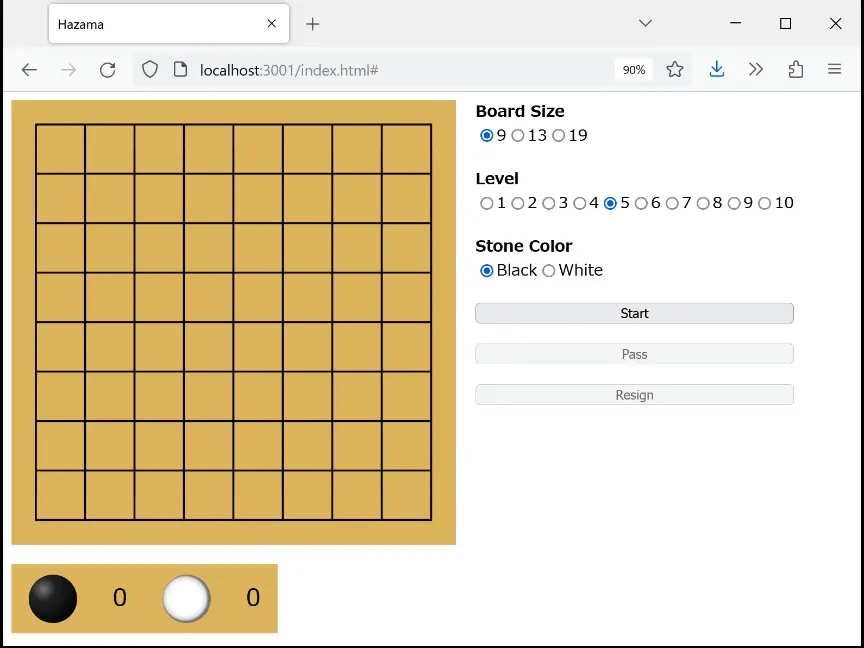

Hazama
===



ウェブブラウザだけで遊べる簡易的な囲碁サービスです。

プログラムの詳細はzennの記事をご覧ください。

https://zenn.dev/tkzwhr/books/go-game-service

## 必要なもの

- client
  - Elm 0.19
- server
  - GNU Go 3.8
  - Rust 1.58

## ビルド＆実行

サーバーから起動する必要があります。

### Server

```shell
$ cd server
$ cargo run
```

### Client

```shell
$ elm make src/Main.elm --output=elm.js
$ elm reactor --port 3001
```

ブラウザで http://localhost:3001/index.html にアクセスしてください。
